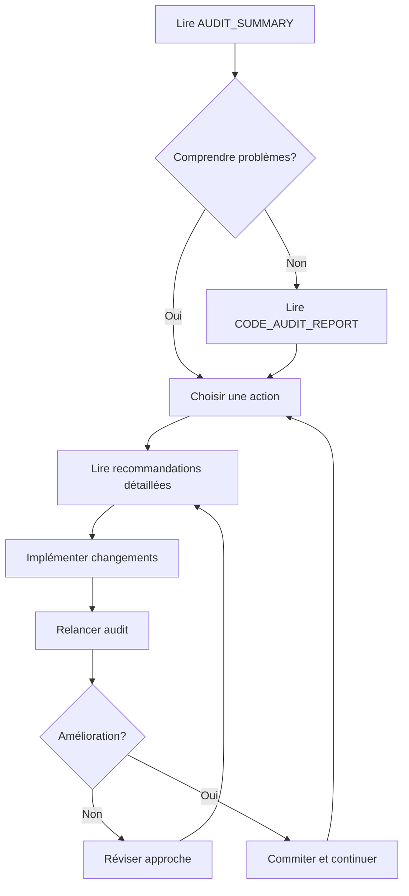

# 🔍 Guide de l'Audit du Code cy8_workspace

## 📖 Introduction

Ce guide vous aide à comprendre les résultats de l'audit complet du code et à planifier les actions de nettoyage.

## 📚 Documents Disponibles

### 1. 📊 [AUDIT_SUMMARY.md](AUDIT_SUMMARY.md) - **COMMENCEZ ICI**
**Résumé exécutif en 5 minutes**
- Vue d'ensemble rapide
- Chiffres clés
- Top 5 des problèmes
- Plan d'action résumé

### 2. 🔍 [CODE_AUDIT_REPORT.md](CODE_AUDIT_REPORT.md)
**Rapport technique détaillé**
- 788 lignes d'analyse
- Liste complète des doublons (29)
- Liste complète des orphelins (401)
- Détail par fichier

### 3. 📋 [CODE_AUDIT_RECOMMENDATIONS.md](CODE_AUDIT_RECOMMENDATIONS.md)
**Guide de recommandations complet**
- Problèmes critiques détaillés
- Plan d'action sur 4 semaines
- Outils recommandés
- Métriques et objectifs

### 4. 📊 [code_audit_data.json](code_audit_data.json)
**Données brutes machine-readable**
- Format JSON
- Pour scripts automatisés
- Intégration CI/CD

### 5. 🔧 [../audit_code.py](../audit_code.py)
**Script d'audit source**
- Réutilisable
- Personnalisable
- Automatisé

## 🚀 Démarrage Rapide

### Étape 1: Lire le Résumé
```bash
# Ouvrir le résumé exécutif
code docs/AUDIT_SUMMARY.md
```

### Étape 2: Consulter les Problèmes
```bash
# Voir les doublons critiques
code docs/CODE_AUDIT_REPORT.md
```

### Étape 3: Choisir une Action
```bash
# Lire les recommandations
code docs/CODE_AUDIT_RECOMMENDATIONS.md
```

### Étape 4: Relancer l'Audit
```bash
# Après modifications, re-auditer
python audit_code.py
```

## 📊 Résultats en Bref

```
✅ 23 fichiers analysés
✅ 21,285 lignes de code
⚠️  29 fonctions en doublon (5%)
⚠️  401 fonctions orphelines (69.5%)
✅ 0 classes en doublon
```

## 🎯 Actions Prioritaires

### 🔴 Haute Priorité (Cette Semaine)
1. Consolider fonction `cancel` (4 doublons)
2. Refactoriser `run_test` (4 doublons)
3. Unifier `center_window` (2 doublons)

### 🟡 Moyenne Priorité (Ce Mois)
1. Créer modules utilitaires
2. Migrer code cy6 → cy8
3. Documenter fonctions orphelines

### 🟢 Basse Priorité (Ce Trimestre)
1. Audit manuel des 401 orphelins
2. Simplifier cy8_prompts_manager_main.py
3. Tests unitaires complets

## 🛠️ Outils Recommandés

```bash
# Installation des outils d'analyse
pip install pylint flake8 vulture radon black pytest

# Utilisation
pylint src/*.py              # Qualité du code
flake8 src/                  # Conformité PEP8
vulture src/                 # Code mort
radon cc src/ -a             # Complexité
black src/                   # Formatage auto
pytest tests/ -v             # Tests
```

## 📈 Métriques de Succès

### Objectifs Phase 1 (Semaine 2)
- [ ] Réduction de 500 lignes (-2.4%)
- [ ] Élimination de 4 doublons (-13.8%)
- [ ] Modules utilitaires créés (+1 fichier)

### Objectifs Phase 2 (Semaine 5)
- [ ] Réduction de 2000 lignes (-9.4%)
- [ ] Élimination de 14 doublons (-48.3%)
- [ ] Migration cy6 complète
- [ ] +4 fichiers (modularité)

### Objectifs Phase 3 (Semaine 9) ⭐
- [ ] Réduction de 3285 lignes (-15.4%)
- [ ] <5 doublons restants (-82.8%)
- [ ] <50 orphelins (-87.5%)
- [ ] +7 fichiers (meilleure structure)

## 🔄 Workflow Recommandé



## 📝 Checklist de Nettoyage

### Avant de Commencer
- [ ] Lire tous les documents d'audit
- [ ] Créer branche `refactor/code-cleanup`
- [ ] Installer outils d'analyse
- [ ] Sauvegarder la base de code actuelle

### Pendant le Nettoyage
- [ ] Travailler sur un problème à la fois
- [ ] Tester après chaque modification
- [ ] Commiter fréquemment
- [ ] Documenter les changements

### Après le Nettoyage
- [ ] Relancer l'audit complet
- [ ] Vérifier les métriques
- [ ] Tester l'application complète
- [ ] Merger la branche de refactoring

## 🎓 Bonnes Pratiques

### DO ✅
- Commencer par les doublons critiques
- Créer des fonctions utilitaires
- Documenter le code
- Tester après chaque changement
- Commiter fréquemment

### DON'T ❌
- Ne pas tout changer en même temps
- Ne pas supprimer sans vérifier
- Ne pas ignorer les tests
- Ne pas oublier de documenter
- Ne pas travailler sans backup

## 💡 Conseils

### Pour les Doublons
1. Vérifier que la logique est vraiment identique
2. Identifier la version la plus complète
3. Créer fonction unifiée dans module utilitaire
4. Remplacer tous les appels
5. Tester exhaustivement

### Pour les Orphelins
1. Ne pas supprimer immédiatement
2. Marquer comme `@deprecated` si obsolète
3. Documenter si c'est un fallback
4. Tester manuellement la fonctionnalité
5. Supprimer seulement si vraiment inutilisé

### Pour la Migration cy6 → cy8
1. Identifier ce qui est encore utilisé
2. Créer équivalent cy8
3. Tester en parallèle
4. Migrer progressivement
5. Supprimer cy6 en dernier

## 📞 Support

### Questions?
- Créer une issue GitHub avec tag `[audit]`
- Référencer ce guide
- Inclure les logs d'audit

### Problèmes avec l'Audit?
- Vérifier les dépendances Python
- Relancer avec `python audit_code.py`
- Consulter [audit_code.py](../audit_code.py)

## 🔗 Liens Utiles

### Documentation Interne
- [AUDIT_SUMMARY.md](AUDIT_SUMMARY.md)
- [CODE_AUDIT_REPORT.md](CODE_AUDIT_REPORT.md)
- [CODE_AUDIT_RECOMMENDATIONS.md](CODE_AUDIT_RECOMMENDATIONS.md)

### Outils Externes
- [pylint](https://pylint.org/)
- [flake8](https://flake8.pycqa.org/)
- [black](https://black.readthedocs.io/)
- [vulture](https://github.com/jendrikseipp/vulture)
- [radon](https://radon.readthedocs.io/)

---

**Dernière mise à jour:** 2025-10-10  
**Version:** 1.0  
**Statut:** ✅ Complet
