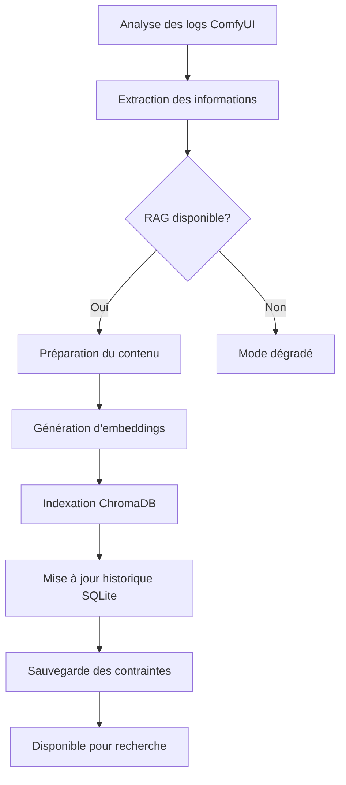

# 📚 Documentation - Intégration RAG dans cy8_prompts_manager

## 🎯 Vue d'ensemble

Le système RAG (Retrieval-Augmented Generation) de `cy8_prompts_manager` est un système hybride intelligent qui combine la recherche vectorielle avec une mémoire persistante pour analyser et mémoriser les erreurs ComfyUI. Il fonctionne en mode **contexte temporel** pour prioriser les informations récentes.

## 🏗️ Architecture du système

### 📦 Composants principaux

```
RAG System Architecture
├── 🧠 RAGManager (cy8_rag_manager.py)
│   ├── ChromaDB (Base vectorielle)
│   ├── SentenceTransformers (Embeddings)
│   ├── SQLite (Contraintes & historique)
│   └── Indexation automatique
├── 🕒 TemporalRAGManager (cy8_temporal_rag.py)
│   ├── Pondération temporelle
│   ├── Recherche avec priorité récente
│   └── Distribution temporelle
└── 🔌 Intégration principale (cy8_prompts_manager_main.py)
    ├── Initialisation automatique
    ├── Indexation des analyses
    └── Chat RAG hybride
```

### 🔄 Flux d'intégration des données



## 📋 Types d'informations intégrées

### 1. 🚨 Résultats d'analyse des logs

**Source :** `analyze_comfyui_log()` dans `cy8_prompts_manager_main.py`

**Données indexées :**
```python
analysis_data = {
    "timestamp": datetime.now().isoformat(),  # Horodatage
    "type": "log_analysis",                   # Type d'analyse
    "environment_id": self.current_environment_id,  # ID environnement
    "filename": filename,                     # Nom du fichier analysé
    "full_analysis": analysis_content,       # Analyse complète
    "errors": [...],                         # Liste des erreurs détectées
    "successes": [...],                      # Liste des succès
    "recommendations": [...]                 # Recommandations générées
}
```

**Processus d'intégration :**
1. ✅ **Extraction** : Analyse du fichier log ComfyUI
2. ✅ **Préparation** : Formatage du contenu pour l'indexation
3. ✅ **Embedding** : Génération des vecteurs avec SentenceTransformers
4. ✅ **Stockage** : Sauvegarde dans ChromaDB avec métadonnées
5. ✅ **Historique** : Mise à jour de l'historique SQLite

### 2. 🔧 Contraintes système

**Source :** `add_constraint()` dans `cy8_rag_manager.py`

**Structure des contraintes :**
```sql
CREATE TABLE system_constraints (
    id INTEGER PRIMARY KEY,
    constraint_type TEXT NOT NULL,      -- Type de contrainte
    constraint_value TEXT NOT NULL,     -- Valeur de la contrainte
    description TEXT,                   -- Description
    created_at TIMESTAMP,              -- Date de création
    updated_at TIMESTAMP               -- Dernière mise à jour
)
```

**Exemples de contraintes :**
- `memory_limit`: `8GB` - Limite mémoire système
- `gpu_model`: `RTX 4090` - Modèle de GPU détecté
- `comfyui_version`: `1.2.3` - Version ComfyUI installée

### 3. 📊 Historique des erreurs

**Source :** `_update_error_history()` dans `cy8_rag_manager.py`

**Structure de l'historique :**
```sql
CREATE TABLE error_history (
    id INTEGER PRIMARY KEY,
    error_type TEXT NOT NULL,          -- Type d'erreur
    error_message TEXT NOT NULL,       -- Message d'erreur
    solution TEXT,                     -- Solution proposée
    frequency INTEGER DEFAULT 1,       -- Fréquence d'occurrence
    first_seen TIMESTAMP,             -- Première occurrence
    last_seen TIMESTAMP               -- Dernière occurrence
)
```

**Mécanisme de fréquence :**
- 🆕 **Nouvelle erreur** : `frequency = 1`
- 🔄 **Erreur récurrente** : `frequency++` et mise à jour `last_seen`
- 💡 **Solution mise à jour** : Écrasement de la solution existante

### 4. 🖥️ État du serveur

**Source :** `_update_server_state()` dans `cy8_rag_manager.py`

**Types d'états :**
- ✅ `healthy` : Serveur en bon état (0 erreur)
- ⚠️ `warning` : Quelques erreurs mais majorité de succès
- ❌ `problematic` : Plus d'erreurs que de succès

**Structure :**
```sql
CREATE TABLE server_state (
    id INTEGER PRIMARY KEY,
    state_type TEXT NOT NULL,          -- Type d'état
    state_value TEXT NOT NULL,         -- Description de l'état
    analysis_result TEXT,              -- JSON complet de l'analyse
    timestamp TIMESTAMP               -- Horodatage
)
```

## 🕒 Système temporel avancé

### ⚡ Pondération temporelle

Le `TemporalRAGManager` applique une pondération intelligente :

```python
# Coefficients temporels
recent_weight = 1.5      # Bonus pour documents récents (<24h)
age_factor = max(0.1, 1 / (1 + doc_age_days / 7))  # Décroissance sur 7 jours
temporal_bonus = recent_weight if doc_age_days <= 1 else 1.0

# Score final
final_score = base_similarity * age_factor * temporal_bonus
```

### 📈 Logique de priorisation

1. **Très récent** (< 24h) : `score × 1.5` (bonus de 50%)
2. **Récent** (1-7 jours) : `score × 1.0` (score normal)
3. **Ancien** (> 7 jours) : `score × 0.1-0.9` (décroissance progressive)
4. **Sans timestamp** : `score × 0.5` (pénalité)

### 🔍 Types de recherche temporelle

```python
# Recherche avec priorité temporelle
temporal_rag.search_with_temporal_priority(
    query="erreur CUDA",
    limit=5,
    recent_weight=1.5,
    max_age_days=30
)

# Recherche récente uniquement
temporal_rag.search_recent_only(
    query="erreur CUDA",
    max_age_hours=24,
    limit=5
)
```

## � Validation critique de l'environment_id

### ⚠️ **PRINCIPE FONDAMENTAL**

**TOUTES les informations indexées dans le RAG DOIVENT être systématiquement liées à l'ID de l'environnement identifié.**

Cette contrainte critique garantit :
- 🎯 **Isolation des données** entre environnements ComfyUI
- 🔍 **Recherche précise** limitée à l'environnement actuel
- 🛡️ **Prévention des interférences** entre différentes installations
- 📊 **Analyses contextuelles** pertinentes et fiables

### 🔧 Mécanismes de validation implémentés

#### 1. **Validation à l'indexation**

```python
def index_analysis_result(self, analysis_result: Dict[str, Any]):
    # VALIDATION CRITIQUE: S'assurer qu'un environment_id est toujours défini
    if not self.environment_id:
        self.logger.error("❌ ERREUR CRITIQUE: Aucun environment_id défini")
        return False

    # VALIDATION: L'analysis_result doit contenir l'environment_id correspondant
    result_env_id = analysis_result.get("environment_id")
    if result_env_id and result_env_id != self.environment_id:
        self.logger.warning(f"⚠️ Incohérence environment_id: {result_env_id} -> {self.environment_id}")
```

#### 2. **Schémas de base de données avec contraintes**

```sql
-- Toutes les tables incluent environment_id avec contraintes d'unicité
CREATE TABLE system_constraints (
    environment_id TEXT NOT NULL,
    constraint_type TEXT NOT NULL,
    constraint_value TEXT NOT NULL,
    UNIQUE(environment_id, constraint_type, constraint_value)
);

CREATE TABLE error_history (
    environment_id TEXT NOT NULL,
    error_type TEXT NOT NULL,
    error_message TEXT NOT NULL,
    UNIQUE(environment_id, error_type, error_message)
);
```

#### 3. **Méthodes de validation dans l'interface**

```python
def validate_rag_environment(self, operation_name: str = "opération RAG") -> bool:
    """Valider que le RAG peut fonctionner avec un environnement identifié"""
    if not self.current_environment_id:
        messagebox.showwarning("Environnement requis", "...")
        return False
    return True

def ensure_analysis_has_environment_id(self, analysis_data: dict) -> dict:
    """S'assurer qu'une donnée d'analyse contient l'environment_id correct"""
    analysis_data["environment_id"] = self.current_environment_id
    return analysis_data
```

### 🛡️ Points de contrôle obligatoires

#### **Avant toute indexation :**
1. ✅ Vérifier que `self.current_environment_id` est défini
2. ✅ Synchroniser `self.rag_manager.environment_id`
3. ✅ Valider la cohérence des données d'analyse
4. ✅ Forcer l'ajout de l'`environment_id` dans les métadonnées

#### **Avant toute recherche :**
1. ✅ Confirmer l'environnement identifié
2. ✅ Filtrer les résultats par `environment_id`
3. ✅ Exclure les données d'autres environnements

#### **Avant l'affichage de contexte :**
1. ✅ Récupérer uniquement les contraintes de l'environnement actuel
2. ✅ Afficher l'historique des erreurs filtré par environnement
3. ✅ Contextualiser l'état du serveur pour l'environnement spécifique

### 📊 Structure des métadonnées obligatoires

**Pour toute donnée indexée :**
```python
metadata = {
    "timestamp": analysis_result.get("timestamp"),
    "environment_id": str(self.environment_id),  # OBLIGATOIRE et validé
    "analysis_type": str(analysis_result.get("type")),
    "validation": {
        "validated_at": datetime.now().isoformat(),
        "validated_environment": self.environment_id,
        "validation_source": "cy8_prompts_manager"
    }
}
```

### 🚨 Gestion des erreurs critiques

**Cas d'échec de validation :**
- 🛑 **Blocage de l'indexation** si aucun environment_id
- 🔄 **Synchronisation automatique** des environment_id incohérents
- 📢 **Alerte utilisateur** pour identifier l'environnement manquant
- 📝 **Logging détaillé** des tentatives d'indexation invalides

### 🔍 Vérification de l'intégrité

**Commandes de diagnostic :**
```python
# Vérifier la cohérence des environment_id
def audit_rag_environment_consistency(self):
    """Auditer la cohérence des environment_id dans le RAG"""

    # 1. Vérifier ChromaDB
    results = self.rag_manager.collection.get(include=["metadatas"])
    env_ids = set()
    for metadata in results.get('metadatas', []):
        env_ids.add(metadata.get('environment_id'))

    # 2. Vérifier SQLite constraints
    constraints = self.rag_manager.get_constraints()
    constraint_envs = set(c.get('environment_id') for c in constraints)

    # 3. Rapport d'audit
    print(f"🔍 Environment_IDs dans ChromaDB: {env_ids}")
    print(f"🔍 Environment_IDs dans SQLite: {constraint_envs}")
    print(f"🔍 Environment_ID actuel: {self.current_environment_id}")
```

## 🔄 Processus d'indexation automatique

### 1. 🎯 Points d'entrée

**Analyse des logs :**
```python
# Dans analyze_comfyui_log()
if self.rag_manager and self.rag_manager.is_available():
    success = self.rag_manager.index_analysis_result(analysis_data)
```

**Sauvegarde des popups :**
```python
# Dans save_popup_analysis()
analysis_data = {
    "timestamp": datetime.now().isoformat(),
    "type": "log_analysis",
    "popup_id": popup_id,
    "filename": filename,
    "full_analysis": analysis_content,
    "environment_id": self.current_environment_id,
    "filepath": filepath
}
```

### 2. 📝 Préparation du contenu

**Méthode :** `_prepare_content_for_indexing()`

**Contenu assemblé :**
```python
content_parts = [
    f"Résumé: {analysis_result['summary']}",
    f"Erreur: {error_message}",
    f"Solution: {solution}",
    f"Succès: {success_message}",
    f"Recommandation: {recommendation}",
    f"Analyse: {full_analysis}"
]
```

### 3. 🔑 Génération d'ID unique

```python
def _generate_document_id(self, analysis_result):
    content = str(analysis_result)
    timestamp = analysis_result.get("timestamp", datetime.now().isoformat())
    unique_string = f"{timestamp}_{content}_{self.environment_id}"
    return hashlib.md5(unique_string.encode()).hexdigest()
```

### 4. 🏷️ Métadonnées enrichies

```python
metadata = {
    "timestamp": analysis_result.get("timestamp"),
    "environment_id": str(self.environment_id),
    "analysis_type": str(analysis_result.get("type", "general")),
    "has_errors": bool(len(analysis_result.get("errors", [])) > 0),
    "error_count": int(len(analysis_result.get("errors", []))),
    "success_count": int(len(analysis_result.get("successes", []))),
    "filename": str(analysis_result.get("filename", "")),
}
```

## 🎮 Interface utilisateur RAG

### 💬 Chat RAG hybride

**Initialisation :**
```python
def initialize_chat_welcome(self):
    if not self.rag_manager or not self.rag_manager.is_available():
        # Mode dégradé
        return

    # Générer contexte avec état du serveur
    context = self.rag_manager.generate_chat_context()
```

**Modes disponibles :**
- ⚡ **RAG Rapide** : Templates prédéfinis + historique local
- 🧠 **RAG Expert** : Recherche vectorielle + Mistral AI + contexte temporel

### 📊 Contextualisation automatique

**Génération du contexte :**
```python
def generate_chat_context(self, user_query=""):
    status = self.get_server_status_summary()
    similar_issues = self.search_similar_issues(user_query, limit=3)

    context = [
        f"État serveur: {status['current_state']['value']}",
        "Contraintes actives: ...",
        "Erreurs récurrentes: ...",
        "Problèmes similaires: ..."
    ]
```

## 🔧 Configuration et initialisation

### 🚀 Initialisation automatique

**Dans `__init__()` de `cy8_prompts_manager` :**
```python
# Gestionnaire RAG pour l'analyse intelligente
self.rag_manager = None
self.temporal_rag = None

if RAG_AVAILABLE:
    try:
        self.rag_manager = RAGManager(self.db_manager, self.current_environment_id)
        self.temporal_rag = TemporalRAGManager(self.rag_manager)
        print("🧠 Gestionnaire RAG initialisé")
        print("🕒 Extension RAG temporelle activée")
    except Exception as e:
        print(f"⚠️ Erreur initialisation RAG: {e}")
        self.rag_manager = None
```

### 🗂️ Structure des répertoires

```
data/
└── analyses/
    ├── {environment_id}/
    │   ├── vector_db/          # Base vectorielle ChromaDB
    │   │   ├── chroma.sqlite3
    │   │   └── ...
    │   └── constraints.db      # Base SQLite contraintes/historique
    └── default/                # Environnement par défaut
```

### 📦 Dépendances requises

```bash
pip install chromadb sentence-transformers

# Modèles d'embeddings supportés :
# - sentence-transformers/all-MiniLM-L6-v2  (léger, recommandé)
# - all-MiniLM-L6-v2                        (nom court)
# - paraphrase-MiniLM-L3-v2                 (très léger)
```

## 🛠️ Maintenance et optimisation

### 🧹 Réinitialisation complète

**Méthode :** `reset_rag_completely()` dans `cy8_prompts_manager_main.py`

```python
def reset_rag_completely(self):
    """Réinitialisation complète du système RAG"""
    try:
        # 1. Fermer les connexions
        if self.rag_manager:
            self.rag_manager.chroma_client = None
            self.rag_manager.collection = None

        # 2. Supprimer les fichiers vectoriels
        vector_db_path = os.path.join("data", "analyses", "vector_db")
        if os.path.exists(vector_db_path):
            shutil.rmtree(vector_db_path)

        # 3. Réinitialiser les composants
        self.rag_manager._initialize_components()
```

### 📈 Monitoring et statistiques

**État du système :**
```python
status = self.rag_manager.get_server_status_summary()
```

**Distribution temporelle :**
```python
distribution = self.temporal_rag.get_temporal_distribution()
```

### ⚡ Modes de fonctionnement

1. **Mode complet** : ChromaDB + SentenceTransformers + SQLite
2. **Mode dégradé** : SQLite seulement (contraintes + historique)
3. **Mode désactivé** : Dépendances manquantes

## 🎯 Cas d'usage

### 1. 🔍 Recherche d'erreurs similaires

```python
# Recherche vectorielle avec contexte temporel
similar_issues = self.rag_manager.search_similar_issues(
    "CUDA out of memory",
    limit=5
)

# Recherche récente uniquement
recent_issues = self.temporal_rag.search_recent_only(
    "CUDA out of memory",
    max_age_hours=24
)
```

### 2. 📊 Analyse de tendances

```python
# État actuel du serveur
status = self.rag_manager.get_server_status_summary()

# Erreurs récurrentes
recurring_errors = status['recurring_errors']

# Contraintes système
constraints = status['constraints']
```

### 3. 💬 Assistance contextuelle

```python
# Génération du contexte pour chat IA
context = self.rag_manager.generate_chat_context(user_query)
```

## 🚀 Extensions futures

### 🔮 Améliorations prévues

1. **Classification automatique** des erreurs par type
2. **Apprentissage des solutions** efficaces par fréquence d'utilisation
3. **Prédiction proactive** des erreurs basée sur l'historique
4. **Intégration Mistral AI** pour génération automatique de solutions
5. **Clustering temporel** des analyses par périodes d'activité
6. **Export/Import** de la base de connaissances entre environnements

### 📊 Métriques avancées

- Taux de résolution des erreurs récurrentes
- Temps moyen entre erreur et solution
- Efficacité des recommandations par environnement
- Distribution temporelle des analyses par type

---

## 🎯 Résumé technique

Le système RAG de `cy8_prompts_manager` fonctionne comme une **mémoire intelligente** qui :

1. **📥 Collecte** automatiquement toutes les analyses de logs
2. **🧠 Comprend** le contenu via des embeddings sémantiques
3. **🕒 Priorise** les informations récentes avec pondération temporelle
4. **🔍 Recherche** des solutions dans l'historique des problèmes similaires
5. **💡 Suggère** des solutions basées sur l'expérience accumulée
6. **📈 Apprend** de chaque nouvelle analyse pour améliorer les futures recommandations

Cette approche transforme chaque analyse en connaissance réutilisable, créant un assistant IA de plus en plus intelligent au fil du temps ! 🚀
