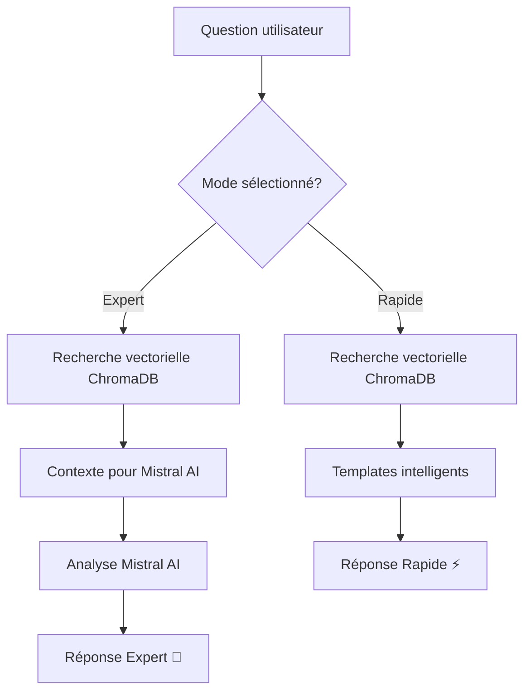

# 🧠 RAG Hybride - Guide d'utilisation

## 🚀 Nouveauté : Système RAG avec deux modes d'analyse

Le système RAG (Retrieval-Augmented Generation) de cy8_prompts_manager dispose maintenant de **deux modes** pour s'adapter à vos besoins :

### ⚡ Mode Rapide
- **Technologie** : Recherche vectorielle + Templates pré-programmés
- **Vitesse** : < 1 seconde
- **Coût** : Gratuit (aucun appel API)
- **Précision** : Bonne pour les problèmes connus
- **Idéal pour** :
  - Erreurs communes ComfyUI
  - Diagnostics rapides
  - Premiers secours
  - Consultation fréquente

### 🧠 Mode Expert
- **Technologie** : Recherche vectorielle + Analyse Mistral AI
- **Vitesse** : 2-5 secondes
- **Coût** : Tokens Mistral (modéré)
- **Précision** : Excellente avec contextualisation
- **Idéal pour** :
  - Problèmes complexes
  - Analyse approfondie
  - Solutions personnalisées
  - Cas non documentés

## 🔄 Fonctionnement

### Architecture du système



### Mode Rapide - Processus détaillé
1. **Recherche vectorielle** dans l'historique des analyses
2. **Analyse des patterns** (types d'erreurs, environnements, solutions)
3. **Génération template** avec conseils spécialisés :
   - CUDA/GPU : Conseils mémoire et compatibilité
   - Custom Nodes : Vérifications installation
   - Modèles : Validation des chemins et permissions
4. **Réponse structurée** avec solutions éprouvées

### Mode Expert - Processus détaillé
1. **Recherche vectorielle** identique au mode rapide
2. **Préparation du contexte** avec analyses similaires
3. **Appel Mistral AI** avec rôle d'expert ComfyUI :
   - Analyse des patterns et corrélations
   - Diagnostic précis basé sur l'historique
   - Solutions spécifiques et priorisées
   - Conseils préventifs personnalisés
4. **Synthèse intelligente** avec métadonnées de performance

## 🎯 Utilisation dans l'interface

### Sélection du mode
Dans l'onglet **Chat**, vous trouverez :
- **Boutons radio** pour choisir le mode
- **Indicateur temps/coût** en temps réel
- **Bouton info (ℹ️)** pour les détails des modes

### Exemples d'utilisation

#### Questions pour le Mode Rapide ⚡
```
• "J'ai une erreur CUDA, que faire ?"
• "Comment installer un custom node ?"
• "Quelles sont les erreurs fréquentes ?"
• "Mon modèle ne se charge pas"
```

#### Questions pour le Mode Expert 🧠
```
• "Analyse approfondie de mes performances ComfyUI"
• "Solutions personnalisées pour mes erreurs récurrentes"
• "Optimisations spécifiques à mon environnement G11"
• "Diagnostic complexe avec corrélations temporelles"
```

## 📊 Comparaison des modes

| Critère | Mode Rapide ⚡ | Mode Expert 🧠 |
|---------|---------------|----------------|
| **Temps de réponse** | < 1 seconde | 2-5 secondes |
| **Coût** | Gratuit | ~0.01-0.05€ par requête |
| **Source** | Templates + Historique | IA + Historique |
| **Contextualisation** | Bonne | Excellente |
| **Nouveauté** | Solutions connues | Solutions créatives |
| **Complexité** | Problèmes standards | Cas complexes/rares |

## 🛠️ Configuration et optimisation

### Prérequis techniques
```bash
# Dépendances RAG
pip install chromadb sentence-transformers

# Configuration Mistral AI pour mode Expert
# Fichier .env
MISTRAL_API_KEY=votre_clé_api_mistral
```

### Optimisation des performances

#### Pour le Mode Rapide
- **Base vectorielle** : Indexation automatique lors des analyses
- **Modèle embeddings** : `all-MiniLM-L6-v2` (léger et efficace)
- **Cache** : Réutilisation des recherches similaires

#### Pour le Mode Expert
- **Gestion des tokens** : Contexte optimisé (max 3 analyses par requête)
- **Fallback automatique** : Retour en mode rapide si erreur Mistral
- **Rate limiting** : Respecte les limites API Mistral

### Monitoring
L'interface affiche en temps réel :
- **Temps de réponse** exact
- **Nombre de documents** consultés
- **Tokens utilisés** (mode Expert)
- **Sources** des analyses consultées

## 🎨 Interface utilisateur

### Indicateurs visuels
- 🔴 **Rouge** : RAG non disponible
- 🟡 **Jaune** : Initialisation en cours
- 🟢 **Vert** : RAG opérationnel
- ⚡ **Éclair** : Mode rapide actif
- 🧠 **Cerveau** : Mode expert actif

### Messages système
```
[10:30:15] ⚡ Mode Rapide activé - Recherche vectorielle...
[10:30:16] 📚 Sources consultées: Analyse G11_logs_001, G11_errors_003
[10:30:16] ⏱️ Temps de réponse: 0.8s | Mode: Rapide | 3 analyses consultées

[10:35:22] 🧠 Mode Expert activé - Analyse avec Mistral AI...
[10:35:28] ⏱️ Temps de réponse: 6.2s | Mode: Expert | Tokens: ~450 | 5 analyses consultées
```

## 🚀 Avantages du RAG Hybride

### Pour les utilisateurs débutants
- **Mode Rapide** offre des réponses instantanées
- **Templates intelligents** guident vers les bonnes pratiques
- **Pas de coût** pour l'apprentissage

### Pour les utilisateurs avancés
- **Mode Expert** fournit des analyses sur mesure
- **Contextualisation avancée** avec l'historique personnel
- **Solutions créatives** pour les cas non documentés

### Pour les administrateurs
- **Monitoring complet** des performances
- **Escalade automatique** des modes selon la complexité
- **Apprentissage continu** grâce à l'indexation automatique

## 📈 Métriques et statistiques

### Données collectées
- **Temps de réponse** par mode
- **Taux de succès** des requêtes
- **Utilisation des tokens** Mistral
- **Patterns d'utilisation** des modes

### Optimisations futures
- **Cache intelligent** pour les requêtes fréquentes
- **Préfiltrage automatique** selon la complexité
- **Apprentissage des préférences** utilisateur

## 🔧 Dépannage

### RAG non disponible
```bash
# Vérifier les dépendances
pip install chromadb sentence-transformers

# Tester l'initialisation
python tests/test_rag_hybride.py
```

### Mode Expert en échec
- Vérifier la clé API Mistral dans `.env`
- Le système bascule automatiquement en mode Rapide
- Consulter les logs pour les détails d'erreur

### Performances dégradées
- **ChromaDB** : Vérifier l'espace disque disponible
- **Embeddings** : Redémarrer l'application si modèle corrompu
- **Mistral API** : Vérifier les quotas et limites

## 🌟 Conclusion

Le RAG Hybride révolutionne l'assistance ComfyUI en combinant :
- **Rapidité** du vectoriel pour les cas courants
- **Intelligence** de Mistral AI pour les analyses complexes
- **Mémoire** de votre historique personnel
- **Flexibilité** selon vos besoins du moment

Commencez par le **Mode Rapide** pour vous familiariser, puis explorez le **Mode Expert** pour les analyses approfondies !

---
*Dernière mise à jour : Octobre 2025*
